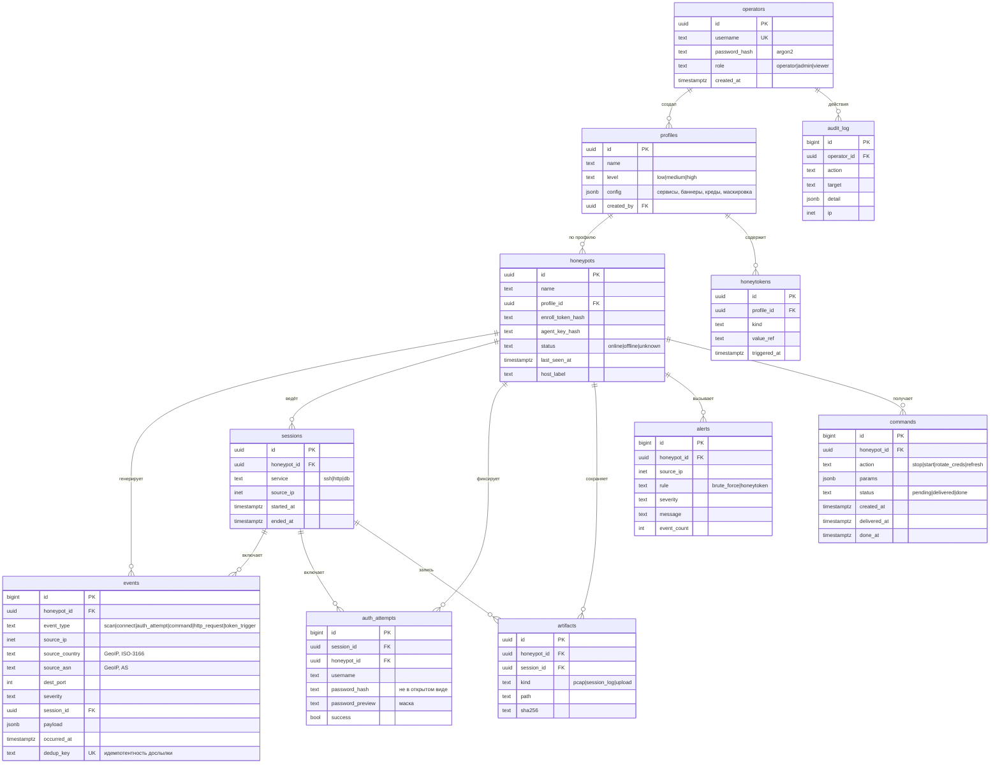

# HoneyForge — схема БД

PostgreSQL, миграции через Alembic. Полное описание полей — в
[DESIGN.md §5](DESIGN.md#5-схема-бд).

```mermaid
erDiagram
  operators ||--o{ profiles : "создал"
  operators ||--o{ audit_log : "действия"
  profiles  ||--o{ honeypots : "по профилю"
  profiles  ||--o{ honeytokens : "содержит"
  honeypots ||--o{ events : "генерирует"
  honeypots ||--o{ sessions : "ведёт"
  honeypots ||--o{ auth_attempts : "фиксирует"
  honeypots ||--o{ artifacts : "сохраняет"
  honeypots ||--o{ alerts : "вызывает"
  honeypots ||--o{ commands : "получает"
  sessions  ||--o{ events : "включает"
  sessions  ||--o{ auth_attempts : "включает"
  sessions  ||--o{ artifacts : "запись"

  operators {
    uuid id PK
    text username UK
    text password_hash "argon2"
    text role "operator|admin|viewer"
    timestamptz created_at
  }
  profiles {
    uuid id PK
    text name
    text level "low|medium|high"
    jsonb config "сервисы, баннеры, креды, маскировка"
    uuid created_by FK
  }
  honeypots {
    uuid id PK
    text name
    uuid profile_id FK
    text enroll_token_hash
    text agent_key_hash
    text status "online|offline|unknown"
    timestamptz last_seen_at
    text host_label
  }
  events {
    bigint id PK
    uuid honeypot_id FK
    text event_type "scan|connect|auth_attempt|command|http_request|token_trigger"
    inet source_ip
    text source_country "GeoIP, ISO-3166"
    text source_asn "GeoIP, AS<num>"
    int dest_port
    text severity
    uuid session_id FK
    jsonb payload
    timestamptz occurred_at
    text dedup_key UK "идемпотентность дослылки"
  }
  sessions {
    uuid id PK
    uuid honeypot_id FK
    text service "ssh|http|db"
    inet source_ip
    timestamptz started_at
    timestamptz ended_at
  }
  auth_attempts {
    bigint id PK
    uuid session_id FK
    uuid honeypot_id FK
    text username
    text password_hash "не в открытом виде"
    text password_preview "маска"
    bool success
  }
  artifacts {
    uuid id PK
    uuid honeypot_id FK
    uuid session_id FK
    text kind "pcap|session_log|upload"
    text path
    text sha256
  }
  honeytokens {
    uuid id PK
    uuid profile_id FK
    text kind
    text value_ref
    timestamptz triggered_at
  }
  alerts {
    bigint id PK
    uuid honeypot_id FK
    inet source_ip
    text rule "brute_force|honeytoken"
    text severity
    text message
    int event_count
  }
  commands {
    bigint id PK
    uuid honeypot_id FK
    text action "stop|start|rotate_creds|refresh"
    jsonb params
    text status "pending|delivered|done"
    timestamptz created_at
    timestamptz delivered_at
    timestamptz done_at
  }
  audit_log {
    bigint id PK
    uuid operator_id FK
    text action
    text target
    jsonb detail
    inet ip
  }
```
